# UI Changes — Before / After

Visual record of the work in commit `a0d6976` (issues **#8–#14**, **#20–#23**).
Screenshots are rendered at 2× from the live app (Playwright); sample data is used
where a warm Mobilism session would otherwise be required.

> Paths are relative to this file, so the gallery renders on GitHub and in most
> Markdown previewers.

---

## Search results

The results area gained a **filter/sort bar**, an **"In library" badge**, an
**expandable synopsis**, and **click-to-zoom covers**. Badge hierarchy was also
quieted so the title leads (format/source are neutral; colour is reserved for
Premium / In-library).

| Before | After |
|---|---|
| 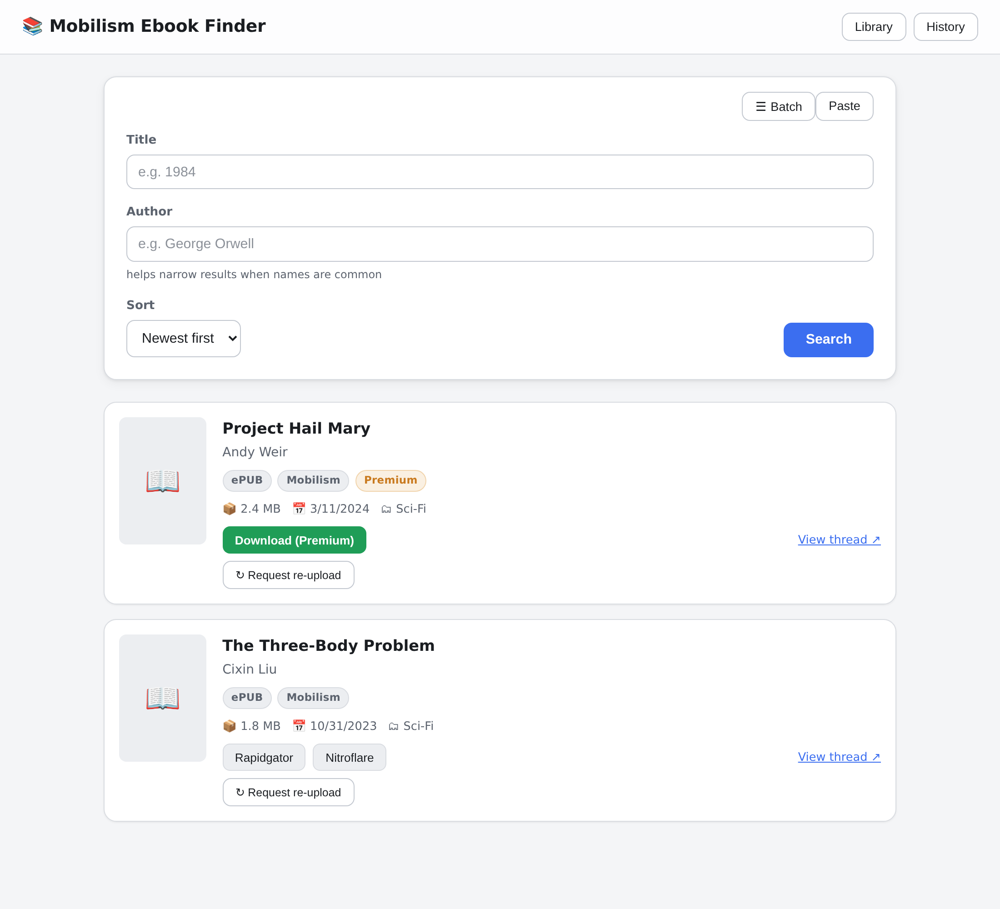 | 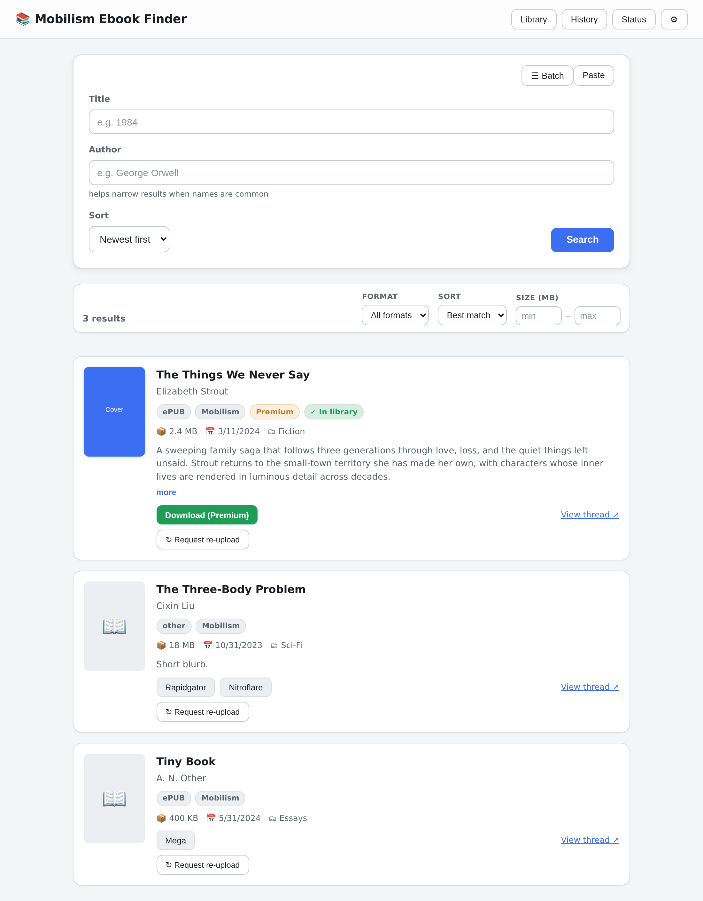 |

### Filtering & sorting (#9) — *new*

`ePUB only` + `Largest first` → live count updates to **"2 of 3"** and the
non-matching result drops out.

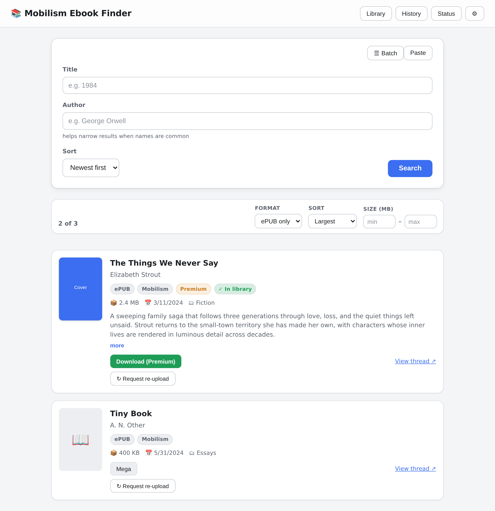

### Cover lightbox (#11) — *new*

Clicking any cover opens it full-size.

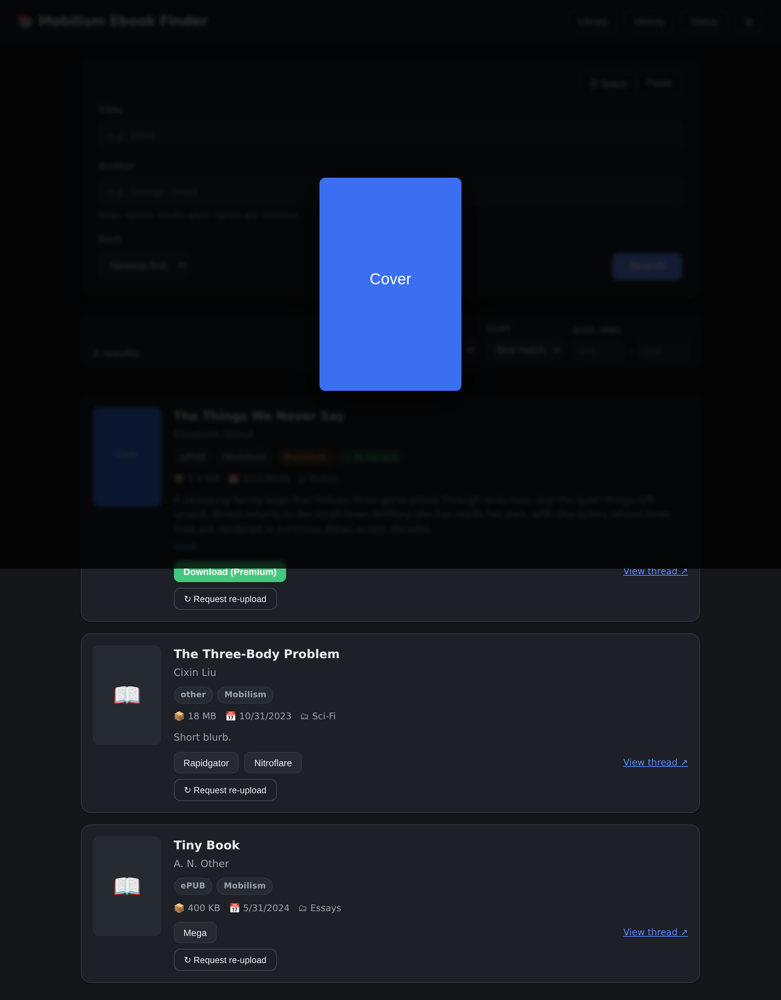

---

## Library

Added **multi-select** (bulk Send / Delete action bar), **per-book tags** with a
tag-filter chip bar, and a **Re-download** button for files missing from disk.

| Before | After |
|---|---|
| 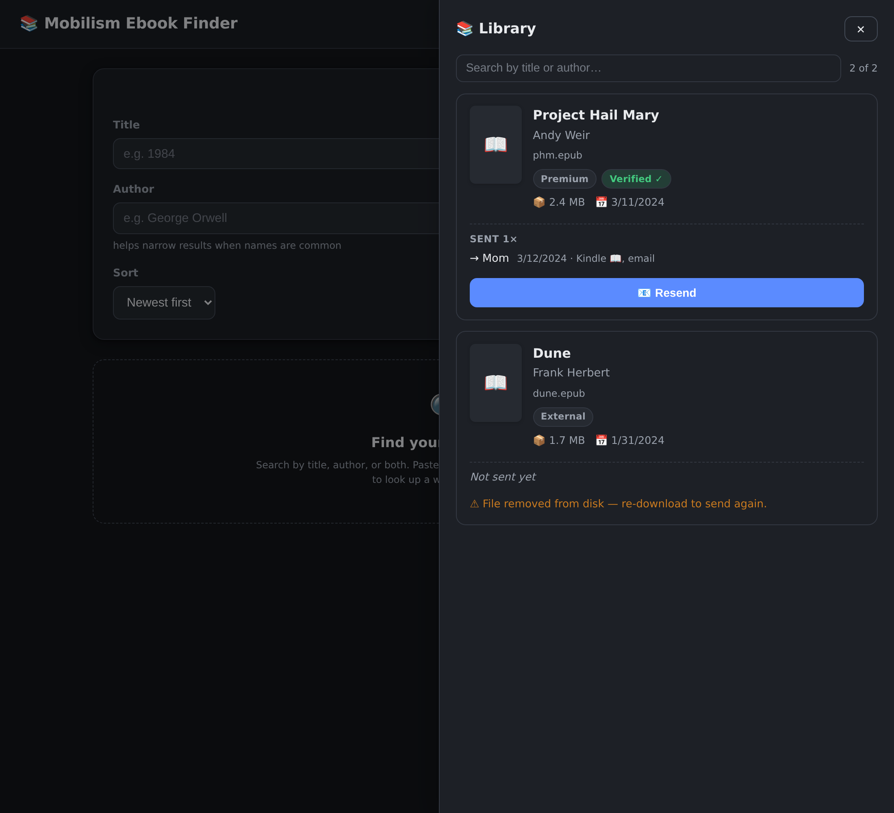 | 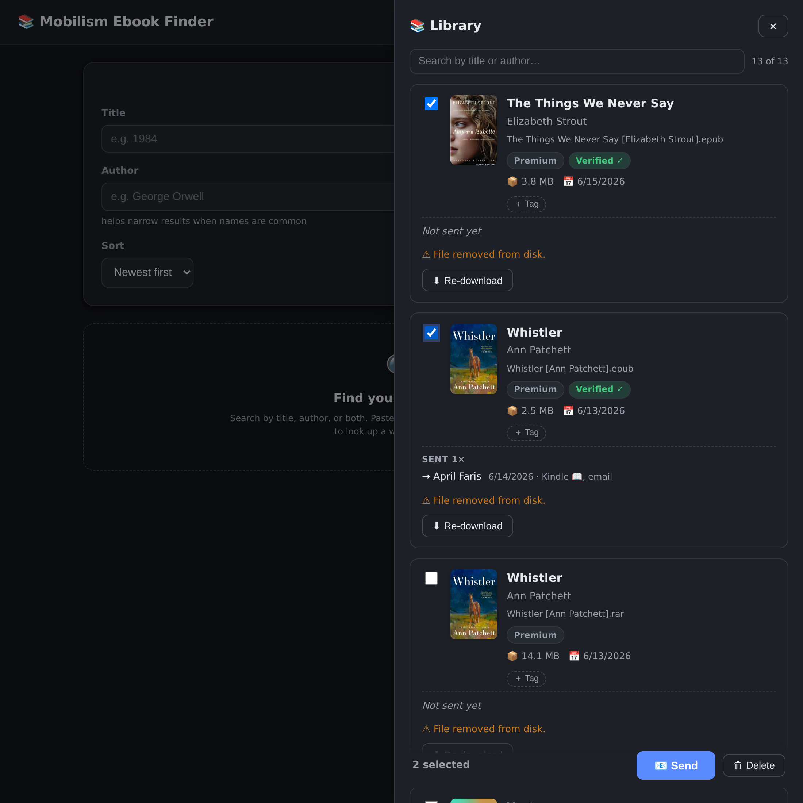 |

---

## History empty state (#21)

Brought in line with the Library's empty state (icon + title + hint).

| Before | After |
|---|---|
| 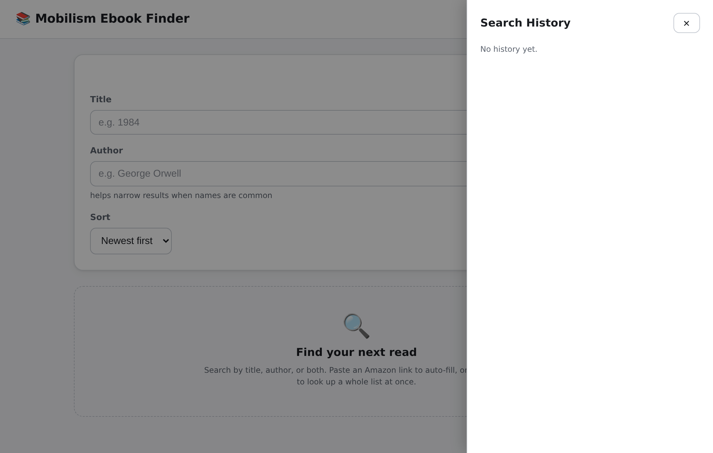 | *(see Library empty-state styling — same treatment)* |

---

## New surfaces

These features are entirely new, so there is no "before".

### Settings panel (#13)

Premium-credential status, notification-channel state, and an SMTP test-send.

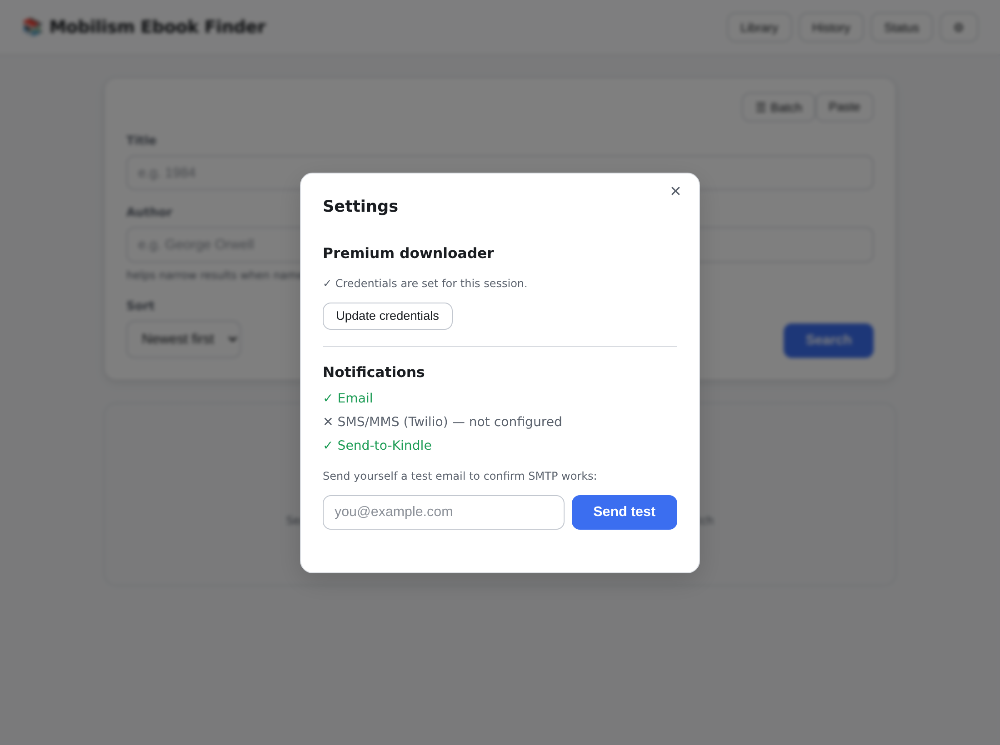

### Status / health view (#14)

Session warmth, download-folder usage + disk free, and channel/credential state.

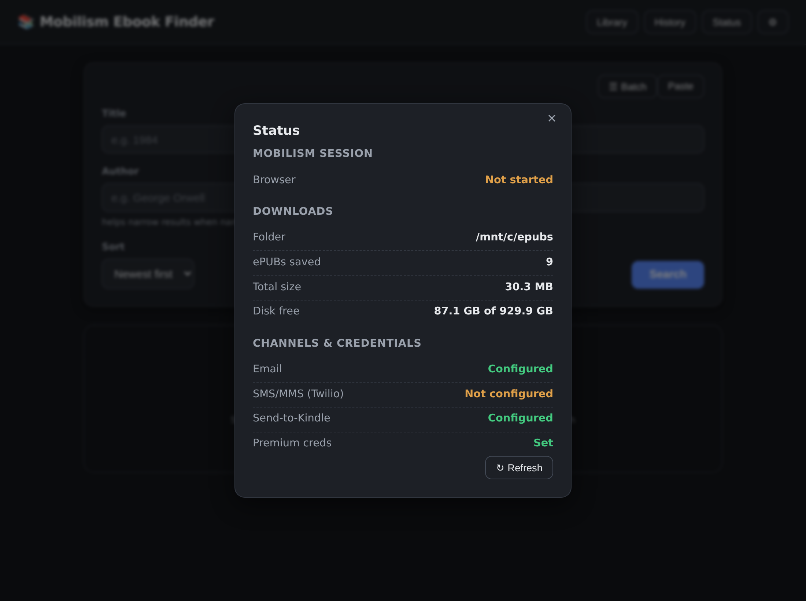

### Recipient groups (#10)

Saved audiences appear as one-click chips above the recipient list.

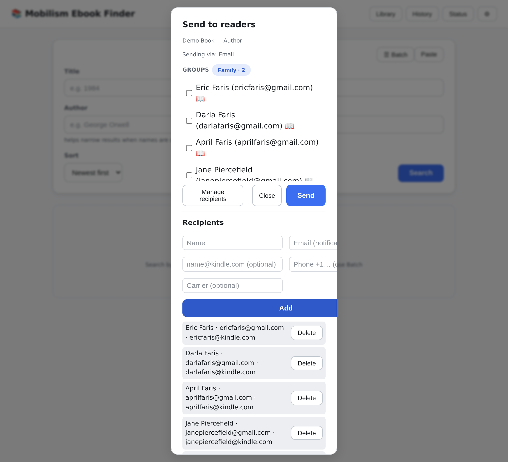

### First-run empty state

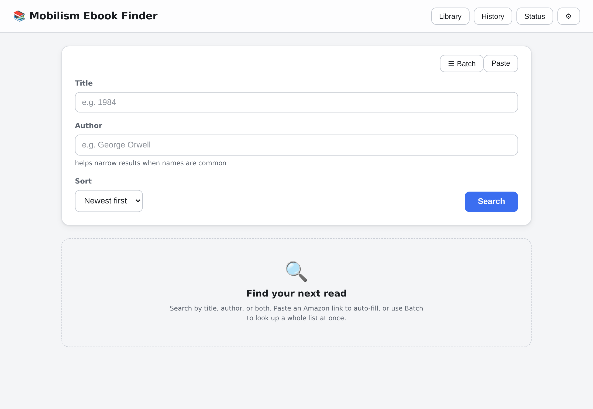

---

## Responsive (#23)

On narrow phones the topbar action buttons wrap to their own row, so the title is
never clipped behind them.

| 390 px | 360 px |
|---|---|
| 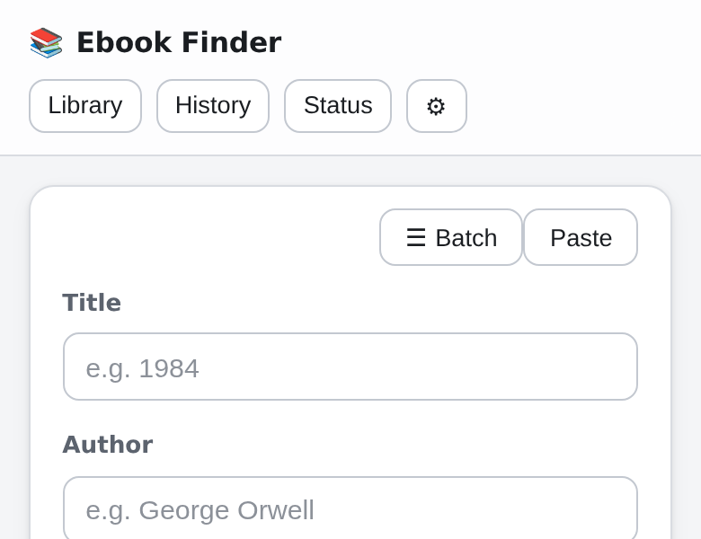 | 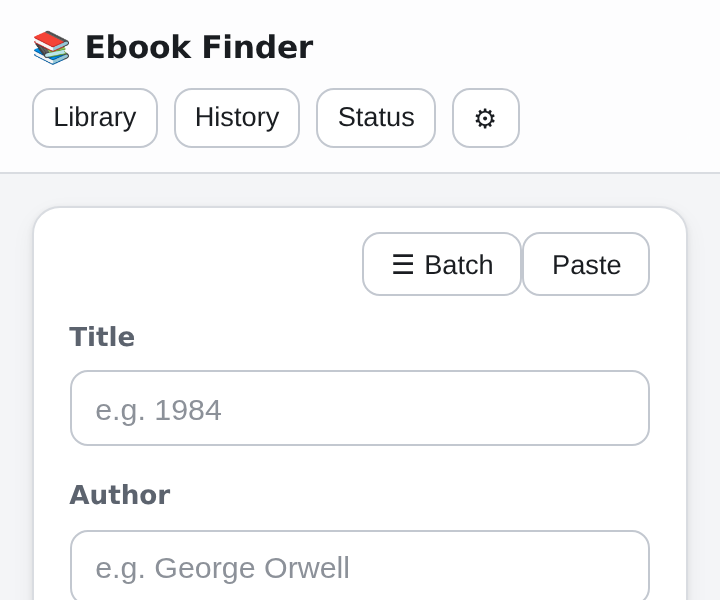 |

---

### Also in this change (not pictured)

- **#8** "In your library" badge (shown on the results card above).
- **#20** Focus trap for every modal/drawer + focus restored to the opener on close.
- **#22** Long titles/filenames wrap instead of breaking the card layout.
